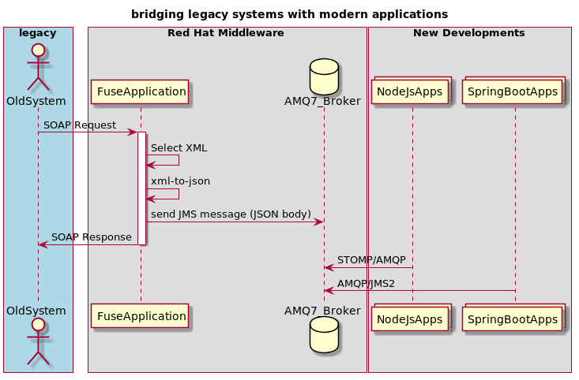
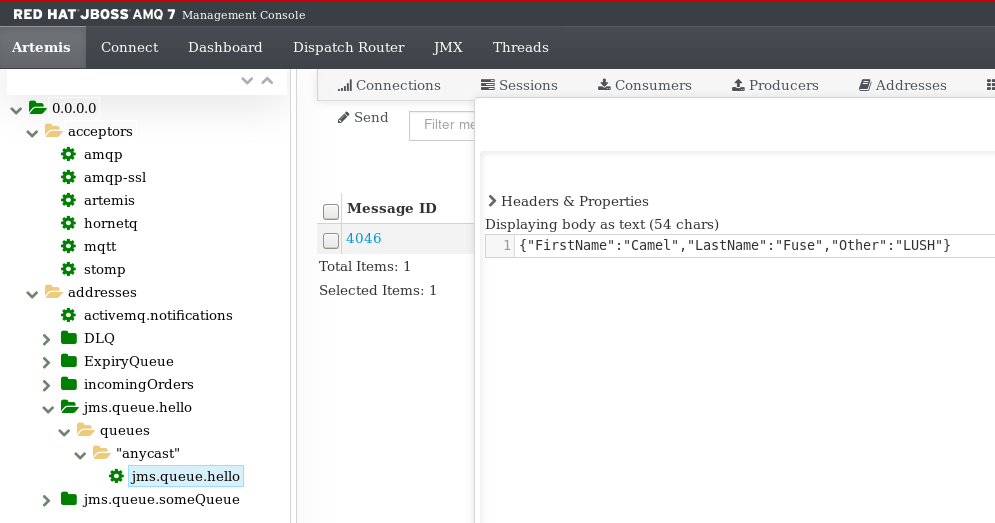
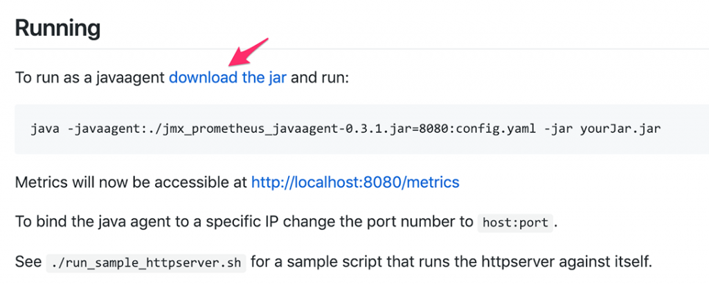
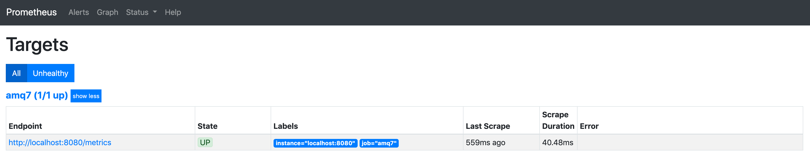
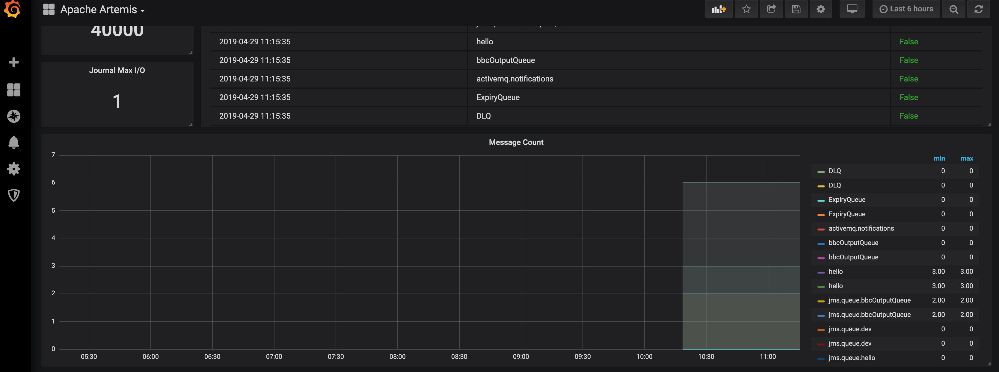

# cxf-soap-wsdlonly-to-json

This is an example use-case where a webservice is required to bridge legacy and modern systems, by way of using Fuse and AMQ7 to bridge them.



No JAXB Marshalling, just a plain SOAP body to JSON.  All in two neat camel routes.

```java
        from("cxf://" + webserviceName + "?wsdlURL=" + webserviceWsdlUrl + "&dataFormat=RAW&serviceName=" + webserviceServiceName + "&endpointName=" + webserviceEndpointName).routeId("cxfRoute")
                .setBody(ns.xpath(webserviceXpath))
                .log("XML body is ${body}")
                .marshal(xmlJsonFormat)
                .convertBodyTo(String.class)
                .log("Body to go to AMQ is ${body}")
                .to("direct:sendToJms")
                .setBody(simple(webserviceSimpleResponse))
                .setHeader("Content-Type", constant("application/xml"))
                .log("Body returned to WS-Client is ${body}");

        from("direct:sendToJms").routeId("jmsSend")
                .setExchangePattern(ExchangePattern.InOnly)
                .removeHeaders("*", "breadcrumbId")
                .to("{{artemis.destination}}");
```

This application can be configured to any WSDL.  It uses the [camel-xmljson dataformat](http://camel.apache.org/xmljson.html) in order to marshall xml to json.

## Application Configuration (application.yml)

The artemis section configures the connection to the JBoss AMQ7 broker, `destination` being the queue where the json will to sent to.

The cxf section configures the webservice, the wsdl exists in this project for simplicity, however, it can exist outside and referenced via `file://some/file/location/wsdl/simpleService.wsdl`.  
`serviceName`, and `endpointName` need to be specified as per the [camel-cxf component documentation](https://github.com/apache/camel/blob/master/components/camel-cxf/src/main/docs/cxf-component.adoc)

```yaml
artemis:
  url: amqp://192.168.122.18:61616
  username: admin
  password: admin
  destination: jms:queue:hello
  useAnonymousProducers: false
  maxConnections: 5

cxf:
  webservice:
    name: SomeService
    serviceName: "{http://www.example.org/SimpleService/}SimpleService"
    endpointName: "{http://www.example.org/SimpleService/}SimpleServiceSOAP"
    wsdlUrl: "wsdl/simpleService.wsdl"
    namespaces:
          soap: "http://schemas.xmlsoap.org/soap/envelope/"
          sim: "http://www.example.org/SimpleService/"
    xpath: "//soap:Body/sim:NewOperation"
    simpleResponse: "resource:classpath:static/response.xml"
```


## Running the application

A prerequisite is having the [AMQ Broker 7.2 installed and running](https://developers.redhat.com/products/amq/download/), ensure it is configured, and the application is configured via the `application.properties` and run:

```text
mvn clean package spring-boot:run
```


## Input and Output

SOAP request in:

```xml
<soapenv:Envelope xmlns:soapenv="http://schemas.xmlsoap.org/soap/envelope/" xmlns:sim="http://www.example.org/SimpleService/">
    <soapenv:Header/>
    <soapenv:Body>
        <sim:NewOperation>
            <FirstName>Camel</FirstName>
            <LastName>Fuse</LastName>
            <Other>LUSH</Other>
        </sim:NewOperation>
    </soapenv:Body>
</soapenv:Envelope>
```

AMQ JSON out (will be in the queue `hello.queue`)

```json
{"FirstName":"Camel","LastName":"Fuse","Other":"LUSH"}
```

And this should be seen in the AMQ management console:



SOAP response received by web service client:

```xml
<soapenv:Envelope xmlns:soapenv="http://schemas.xmlsoap.org/soap/envelope/" xmlns:sim="http://www.example.org/SimpleService/">
    <soapenv:Header/>
    <soapenv:Body>
        <sim:NewOperationResponse>
            <out>OK</out>
        </sim:NewOperationResponse>
    </soapenv:Body>
</soapenv:Envelope>
```

## Unit testing and integration testing

To unit test the application locally, an embedded broker is created. To unit test, run the following:

```text
mvn clean test -Denvironment=local
```

To run integration tests connecting to the live AMQ Broker:
1. change the artemis.url value in the yaml file:
src/test/resources/application-{environment}.yml

NOTE: if the yaml file for the required environment that is running AMQ does not exist, please create it.

2. run:

```text
mvn clean verify -Denvironment={environment}
```

## Load testing the application

Siege can be used to load test and send many SOAP payloads to the application.  In order to do so, run the following:

```text
mvn clean spring-boot:run
siege --rc=.siegerc
```

Change the configuration in the `.siegerc` file.

## Getting metrics from the application

Metrics for the application are exposed by the prometheus agent jar if it is added as a javaagent.  A prometheus config file for the application is included to expose metrics for Fuse/Camel/CXF.

```text
mvn clean package
java -javaagent:./prometheus/jmx_prometheus_javaagent-0.11.0.jar=9090:./prometheus/config.yml -jar target/fuse72-cxfsoap-wsdlonly-to-json-1.0-SNAPSHOT.jar
```

This will enable a prometheus metrics endpoint and will serve on http://localhost:9090

```text
...
org_apache_camel_ExchangesTotal{context="Soap2Json2AmqContext",processor="\"log2\"",type="processors",} 0.0
# HELP org_apache_camel_LastProcessingTime Last Processing Time
# TYPE org_apache_camel_LastProcessingTime gauge
org_apache_camel_LastProcessingTime{context="Soap2Json2AmqContext",route="\"cxfRoute\"",type="routes",} -1.0
org_apache_camel_LastProcessingTime{context="Soap2Json2AmqContext",type="context",} -1.0
org_apache_camel_LastProcessingTime{context="Soap2Json2AmqContext",processor="\"setExchangePattern1\"",type="processors",} -1.0
org_apache_camel_LastProcessingTime{context="Soap2Json2AmqContext",processor="\"log1\"",type="processors",} -1.0
org_apache_camel_LastProcessingTime{context="Soap2Json2AmqContext",processor="\"marshal1\"",type="processors",} -1.0
...

```

## Points of Note

### JMS

There are multiple types of JMS libraries in the application, why?

- AMQ7 artemis client libraries in the main application: org.messaginghub/pooled-jms/${pooled.jms.version} and org.apache.qpid/qpid-jms-client/${qpid.jms.client.version}
- AMQ5.x libraries in the unit test (broker and client): SoapToJsonUnitTest.java uses org.apache.activemq/activemq-broker/5.11.0.redhat-630371

The unit test spins up an in-memory broker and overrides the client jms configuration in order to use that embedded in-memory broker.


### Unit Testing with RestTemplate

SOAP testing.  Effectively a SOAP client is a HTTP Post with a specific SOAPAction header.  The Unit Test test the service as that also.

```java

    HttpHeaders headers = new HttpHeaders();
    headers.setContentType(MediaType.APPLICATION_XML);
    headers.set("SOAPAction", "http://www.example.org/SimpleService/NewOperation");

    HttpEntity<String> entity = new HttpEntity<String>(soapRequest, headers);
    //HttpEntity
    ResponseEntity<String> response = restTemplate.postForEntity("/services/SomeService", entity, String.class);

```

## Setting up the AMQ7 Broker.

- Download from Jboss Portal
- Follow the install documentation :)

### Generating keystores and truststores with OpenSSL and keytool
 
 ```text
 # Create a broker key and cert - import the keypair and cert into the broker keystore
 openssl req -newkey rsa:2048 -nodes -keyout broker_keypair.pem -x509 -days 65000 -out broker_cert.pem
 openssl pkcs12 -inkey broker_keypair.pem -in broker_cert.pem -export -out broker_ks.p12
 
 # Create a client key and cert - import the keypair and cert into the client keystore
 openssl req -newkey rsa:2048 -nodes -keyout client_keypair.pem -x509 -days 65000 -out client_cert.pem
 openssl pkcs12 -inkey client_keypair.pem -in client_cert.pem -export -out client_ks.p12
 
 # Create a truststore for the broker, and import the client's certificate. This establishes that the broker "trusts" the client:
 keytool -import -alias client -keystore broker_ts.p12 -file client_cert.pem -deststoretype pkcs12
 
 # Create a truststore for the client, and import the broker's certificate. This establishes that the client "trusts" the broker:
 keytool -import -alias broker -keystore client_ts.p12 -file broker_cert.pem -deststoretype pkcs12
```

The above keystores and truststores were created and given the password `password`


### Configure the broker.xml acceptor

The `broker_ks.p12` and `broker_ts.p12` files should reside in the `$BROKER_HOME/etc` directory.  Ensure this acceptor is in the `broker.xml` file:

```xml
<!-- AMQPS Acceptor.  Listens on default AMQPS port for AMQPS traffic.-->
<acceptor name="amqp-ssl">tcp://0.0.0.0:5671?tcpSendBufferSize=1048576;tcpReceiveBufferSize=1048576;protocols=AMQP;useEpoll=true;amqpCredits=1000;amqpMinCredits=300;connectionsAllowed=1000;sslEnabled=true;keyStorePath=broker_ks.p12;keyStorePassword=password;trustStorePath=broker_ts.p12;trustStorePassword=password</acceptor>
```

### Configure the client

The url by which the client connects needs to have the path to the trustStore, example below:

```yaml
artemis:
  url: amqps://localhost:5671?transport.trustStoreLocation=/home/user/AppServers/examplebroker/etc/client_ts.p12&transport.trustStorePassword=password&transport.verifyHost=false&jms.sendTimeout=5000
  username: theuser
  password: Thepassword1!
```

Once both broker and client are configured correctly, and the application is running against the broker, then the client log should display the following:

```text
2019-04-16 12:31:54.624  INFO 19120 --- [0.0-8080-exec-1] cxfRoute                                 : Body to go to AMQ is {"FirstName":"Camel","LastName":"Fuse","Other":"asdasdasdasdasd"}
2019-04-16 12:31:55.792  INFO 19120 --- [localhost:5671]] o.a.qpid.jms.sasl.SaslMechanismFinder    : Best match for SASL auth was: SASL-PLAIN
2019-04-16 12:31:55.850  INFO 19120 --- [localhost:5671]] org.apache.qpid.jms.JmsConnection        : Connection ID:5ed21a51-0b0e-44b2-b89f-2c7a9d99c126:1 connected to remote Broker: amqps://localhost:5671
```

### Setting up metrics for AMQ7 Broker...

We will be using JMX, JMX exporter to gather metrics and expose via http, Prometheus to collect and analyse the collected metrics and Grafana to create user friendly dashboards.

#### Configure the JMX Exporter agent

1- Download the JMX Exporter jar from https://github.com/prometheus/jmx_exporter



2- Place the .jar file somewhere accessible to the Java application
Example: {amp_install_dir}/instances/{instance_name}/bin

3- Create a configuration file for the JMX exporter. Get the artemis-2.yml file from https://github.com/prometheus/jmx_exporter/tree/master/example_configs and place it in the same place as the .jar file
Example: {amp_install_dir}/instances/{instance_name}/bin

4- Add JVM parameter on artemis Java application to load the JMX Exporter agent on application startup.
Normally Java applcations have will have a configuration file for specifying JVM parameters. In the case of AMQ, that is the {amp_install_dir}/instances/{instance_name}/etc/artemis.profile file

```text
- Locate JAVA_ARGS and rename it to JAVA_OPTS

- Create the following entry just after JAVA_OPTS (The variable JAVA_ARGS is used in artemis run script):

    #Variable containing arguments for JMX_EXPORTER and JAVA_OPTS
    JAVA_ARGS="$JAVA_OPTS -javaagent:{amq_install_dir}/instances/{instance_name}/bin/jmx_prometheus_javaagent-0.11.0.jar=8080:    {amq_install_dir}/instances/{instance_name}/bin/config.yml”
    
- Confirm if artemis allows remote JMX access: go to the Artemis script {amq_install_dir}/instances/{instance_name}/bin/artemis and make sure the final command has:

        -Dcom.sun.management.jmxremote=true \

  The final command should look like:

        exec "$JAVACMD" \
            $JAVA_ARGS \
            -Xbootclasspath/a:"$LOG_MANAGER" \
            -Djava.security.auth.login.config="$ARTEMIS_INSTANCE_ETC/login.config" \
            $ARTEMIS_CLUSTER_PROPS \
            -classpath "$CLASSPATH" \
            -Dartemis.home="$ARTEMIS_HOME" \
            -Dartemis.instance="$ARTEMIS_INSTANCE" \
            -Djava.library.path="$ARTEMIS_HOME/bin/lib/linux-$(uname -m)" \
            -Djava.io.tmpdir="$ARTEMIS_INSTANCE/tmp" \
            -Ddata.dir="$ARTEMIS_DATA_DIR" \
            -Dartemis.instance.etc="$ARTEMIS_INSTANCE_ETC" \
            -Djava.util.logging.manager="$ARTEMIS_LOG_MANAGER" \
            -Dlogging.configuration="$ARTEMIS_LOGGING_CONF" \
            -Dcom.sun.management.jmxremote=true \
            $DEBUG_ARGS \
            org.apache.activemq.artemis.boot.Artemis "$@"
```
#### Thats it!! 
Run the artemis instance normally and verify the exposed artemis metrics in http://localhost:8080/metrics

#### Consuming Metrics with Prometheus

- Download Prometheus and go through the quick start: https://prometheus.io/docs/prometheus/latest/getting_started/

- Create a new prometheus config file -> amq7-monitor.yml or add configurations to an existing one
Example:
```text
global:
  scrape_interval: 15s # By default, scrape targets every 15 seconds.
  external_labels:
    monitor: 'amp7-monitor'
#rule_files:
#  - 'prometheus.rules.yml'
scrape_configs:
  - job_name: 'amq7'
    scrape_interval: 5s
    static_configs:
      - targets: ['localhost:8080']
```

- Launch Prometheus, passing in the configuration file as a parameter, by running the following command:

```text
./prometheus --config.file=amq7-monitor.yml
```

- Validate the received metrics

```text
Go to http://localhost:9090, click Status -> Targets and validate the state of http://localhost:8080/metrics is up     
```



#### Create Dashboards with Grafana

- Download Grafana from https://grafana.com/grafana/download based on the OS and unzip to a location

- Start the Grafana server ./{GRAFANA_HOME}/bin/grafana-server -> console should be available at localhost:3000

- Create a new data source with:

        * Name: DS_Prometheus
        * Type: Prometheus
        * URL: localhost:9090

- Create a new dashboard for Artemis by importing the file from: https://grafana.com/api/dashboards/9087/revisions/1/download and selecting the data source DS_Prometheus (Data source: https://grafana.com/dashboards/9087)

  - Instead of importing directly, download the json file and replace all the text occurrences of “broker” to “$job"
  - Add the following entry in the list “templating” in dashboard json file:

  ```json
  "templating": {
    "list": [
      {
        "current": {
          "text": "amq7",
          "value": "amq7"
        },
        "hide": 0,
        "label": null,
        "name": "job",
        "options": [
          {
            "selected": true,
            "text": "amq7",
            "value": "amq7"
          }
        ],
        "query": "amq7",
        "skipUrlSync": false,
        "type": "constant"
      }
    ]
  }
  ```
  - Import the json file to create the dashboard



## Healthchecks

### AMQ7 Broker

Here are two ways of monitoring the running AMQ7 broker with bash healthchecks:

1.  By using the AMQ7 jolokia endpoint
2.  By interacting with AMQ7 using STOMP

#### Using Jolokia and Curl

See `./amq7/healthchecks/jolokia`

```text
curl -d '[{"type":"read","mbean":"hawtio:type=Registry","attribute":"UpdateCounter","config":{}},{"type":"read","mbean":"hawtio:type=TreeWatcher","attribute":"Counter","config":{}},{"type":"read","mbean":"org.apache.activemq.artemis:broker=\"0.0.0.0\"","config":{}}]' -H "Content-Type: application/json" -X POST -u admin:admin http://192.168.122.18:8161/console/jolokia/?maxDepth=7&maxCollectionSize=5000&ignoreErrors=true&canonicalNaming=false
```

#### Using Bash and STOMP

See `./amq7/healthchecks/STOMP`

```text
echo "some test message" | ./produce -h 192.168.122.18 -p 61613 -q hello1 -U admin -P admin && ./consume -h 192.168.122.18 -p 61613 -q hello1 -c ./echo-handler -U admin -P admin 2>&1 | tail -10 | grep --line-buffered "some test message"
echo $?
```


## Setting up Webserver security

### SSL

1. We need to create the necessary keystores and certificates and truststores, please note:

It is recommended to use the PKCS12 format which is an industry standard format.

```text        
# Create a service key and cert - import the keypair and cert into the service keystore

openssl req -newkey rsa:2048 -nodes -keyout service_keypair.pem -x509 -days 65000 -out service_cert.pem
openssl pkcs12 -name service -inkey service_keypair.pem -in service_cert.pem -export -out service_ks.p12

# Create a client key and cert - import the keypair and cert into the client keystore

openssl req -newkey rsa:2048 -nodes -keyout client_keypair.pem -x509 -days 65000 -out client_cert.pem
openssl pkcs12 -name client -inkey client_keypair.pem -in client_cert.pem -export -out client_ks.p12

# Create a truststore for the service, and import the client's certificate. This establishes that the service "trusts" the client:

keytool -import -alias client -keystore service_ts.p12 -file client_cert.pem -deststoretype pkcs12

# Create a truststore for the client, and import the service's certificate. This establishes that the client "trusts" the service:

keytool -import -alias service -keystore client_ts.p12 -file service_cert.pem -deststoretype pkcs12
```

So now we have:
- Service key and certificate imported in the service keystore
- Client key and certificate imported in the client keystore
- Service truststore with the client certificate imported
- Client truststore with the service certificate imported
         
NOTE: Save the chosen keystore/truststore passwords


2. To secure the webservice, we need to enable ssl. This can be done via configurations on the application (application.properties/application.yml). Please see the following extract of application.yml:

```text
server:
  address: 0.0.0.0
  ssl:
    key-store: classpath:security/service_ks.p12
    key-store-type: pkcs12
    key-store-password: redhat
    key-alias: service
    clientAuth: need
    trust-store: classpath:security/service_ts.p12
    trust-store-password: redhat
security:
  require-ssl: true
```

NOTE: Check other security options on:
https://docs.spring.io/spring-boot/docs/current/reference/htmlsingle/#howto-configure-ssl

3. To ensure Maven does not corrupt/filter characters in the keystore, add the following to the pom:

```xml
<resources>
    <resource>
        <directory>src/main/resources</directory>
        <filtering>true</filtering>
        <excludes>
            <exclude>**/*.p12</exclude>
        </excludes>
    </resource>
    <resource>
        <directory>src/main/resources</directory>
        <filtering>false</filtering>
        <includes>
            <include>**/*.p12</include>
        </includes>
    </resource>
</resources>

Test this setup using SOAP-UI or your preferred client.
How to set keystores/truststores for a SOAP-UI project:
https://blogs.sap.com/2011/01/06/soap-ui-tool-soap-https-client-authentication/
```
  

## Further Documentation

- https://access.redhat.com/documentation/en-us/red_hat_fuse/7.2/
- https://access.redhat.com/documentation/en-us/red_hat_fuse/7.2/html/deploying_into_spring_boot/index
- https://access.redhat.com/documentation/en-us/red_hat_amq/7.2/html-single/using_the_amq_jms_pool_library
- https://camel.apache.org/cxf.html
- https://github.com/apache/camel/blob/master/components/camel-cxf/src/main/docs/cxf-component.adoc
- https://blogs.sap.com/2011/01/06/soap-ui-tool-soap-https-client-authentication/
- https://www.baeldung.com/spring-boot-https-self-signed-certificate
- https://docs.spring.io/spring-boot/docs/current/reference/htmlsingle/#howto-configure-ssl
- [Red Hat Jboss AMQ Supported configurations](https://access.redhat.com/articles/2791941)
- [Monitoring with the JMXTrans agent](https://developers.redhat.com/blog/2018/06/06/monitoring-red-hat-amq-7-with-the-jmxtrans-agent/)
- [Jolokia JVM Monitoring](https://developers.redhat.com/blog/2016/03/30/jolokia-jvm-monitoring-in-openshift/)
- [STOMP with AMQ7 and Python](https://developers.redhat.com/blog/2018/06/14/stomp-with-activemq-artemis-python/)
- [STOMP with AMQ7 and BASH](http://nullendpoint.com/redhat/2019/04/17/producing-and-consuming-amq7-messages-with-STOMP-and-bash/)
